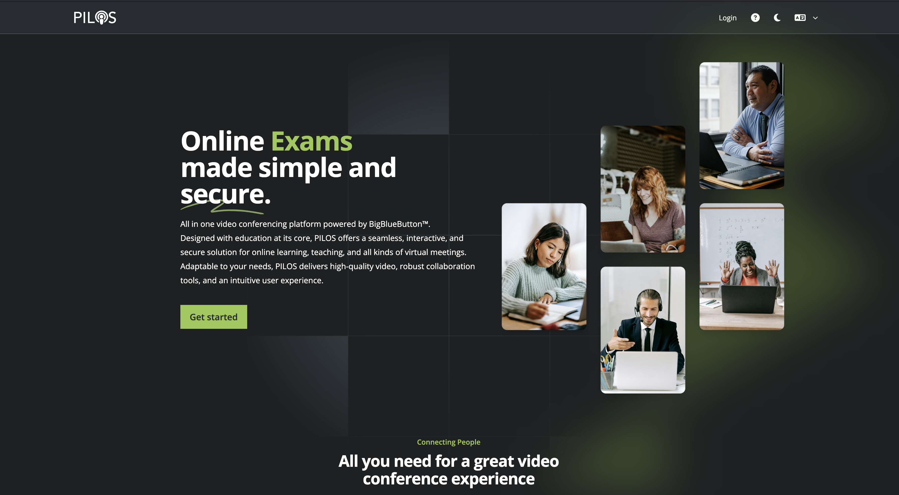

import Tabs from '@theme/Tabs';
import TabItem from '@theme/TabItem';

## Einleitung

Welcome to the PILOS video conferencing platform. This quick guide is designed to help you get started quickly and show you how to create a new room.

## Login

Click on “Log in” in the top right corner.

Then select your login type. This dialog may have different login types depending on the installation.

:::note
  Your organization may have chosen to assign the preferred login type a more familiar name, such as “SampleUniversity Login”. These are usually LDAP or Shibboleth logins.
:::

<Tabs>
  <TabItem value="shib" label="Shibboleth" default>
   Click the “Log in” button. You will be redirected to your usual login portal, where you may have to log in and will then be redirected back to PILOS.

   [ldap](assets/intro/shib.png)

  </TabItem>
  <TabItem value="ldap" label="LDAP" default>
    Enter your LDAP user ID and password in the input mask (1-2) and then click on “Log in” (3).

   [ldap](assets/intro/ldap.png)

  </TabItem>
  <TabItem value="email" label="Email">
   If you have received access data specifically for PILOS, please log in using this option.

   Enter your e-mail and password in the input mask (1-2) and then click on “Log in” (3).

  :::tip
    If you have forgotten your password, you can click on “Forgot your password?” to have a password reset link sent to your e-mail address.
  :::

  [email](assets/intro/email.png)
  </TabItem>
</Tabs>

## 2. Create A Room

You are now on your personal start page, where you will find your own rooms.
Your room memberships with other users are also displayed here.

To create a new room, click on “Create new room” under the “My rooms” section.

[startpage](assets/intro/startpage.png)

In the pop-up window that opens, select the desired room type (1), specify a name for the room (2) and click on “Create” (3).

[neu](assets/intro/neu.png)

## 3. Start Room

The new room has been created and you can now use it.
To share the room with other users, click on the copy button (1) and distribute the copied information by e-mail, for example.

If you want to start the video conference room, click on “Start” (2).

:::info Learn more

[Operation of the video conference](bbb/index.mdx)

:::

[start](assets/intro/start.png)

## 4. Customize Room

:::note This step is optional
:::

The room is currently protected with an access code and can only be used by registered users.
Take a look at the rest of the documentation to learn how to customize the room to your needs.
Good luck!

:::info Learn more

- [Room settings](room/settings)
- [Manage presentations](room/functions/files)
- [Personalized room links](room/functions/roomlinks)

:::
